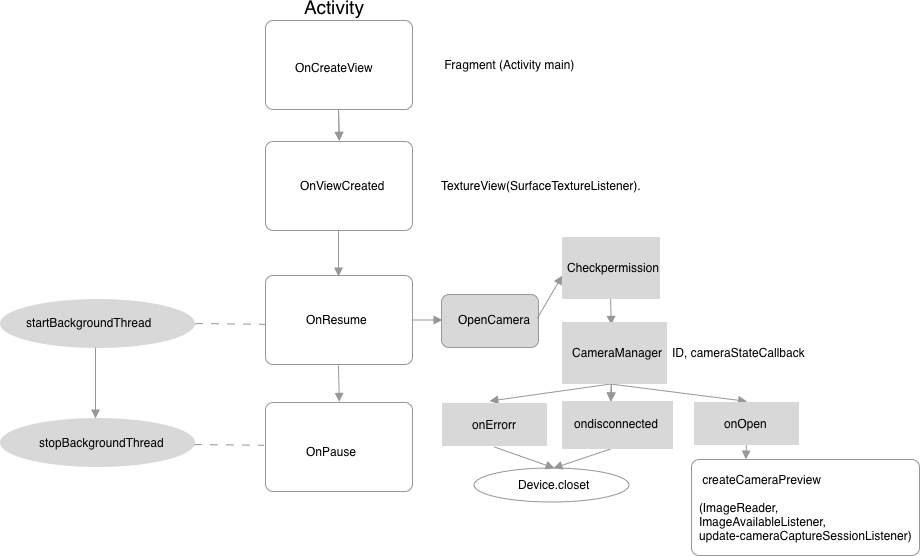

# QRcode

----

#### Goal

1. Camera catch the frame
2. Get the QR image automatically
3. Get the URL

#### Solutions

1. Barcode + camera2   

    <https://github.com/kfir333/Barcode-Scanner-Camera2.git>

2. Barcode + camera(google ML kit).     

   <https://github.com/googlesamples/android-vision.git>

3. dynamicBarcode + camera2.  

   <https://github.com/dynamsoft-dbr/Android-barcode-camera2scanner>

----

#### Implementation

##### Barcode + camera2

 